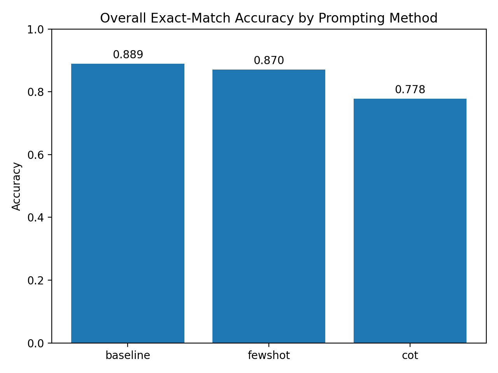
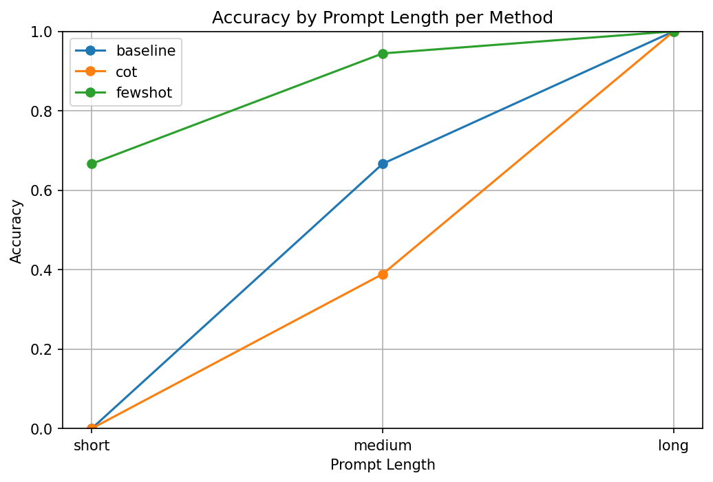
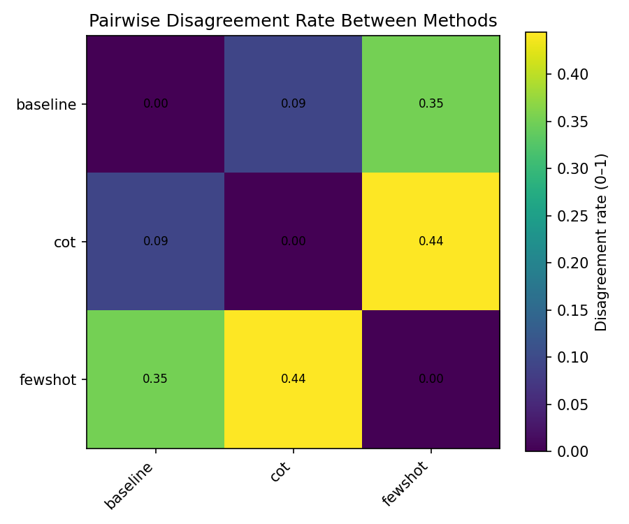
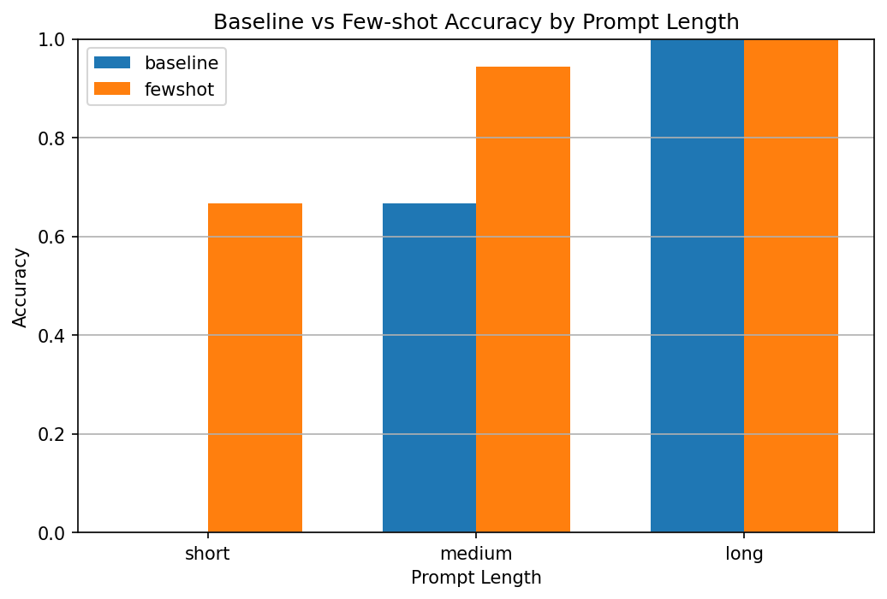

# Prompt Engineering Project

## Overview

This project investigates prompt engineering strategies for Large Language Models (LLMs)
within a structured, reproducible experimental framework. In addition to evaluating
prompting methods and reporting empirical results, the project explicitly demonstrates
**agent-based development**, as required by the course-wide guidelines.

Throughout the development process, an LLM was used as an *active agent* to:
- understand and refine assignment requirements,
- design the experimental architecture,
- debug implementation details,
- analyze unexpected experimental behavior,
- audit the repository against submission guidelines,
- and assist in writing technical documentation.

Accordingly, this repository should be viewed not only as a prompt-engineering experiment,
but also as a case study in **using LLMs as collaborators in software and research workflows**.

This README focuses on:
- installation and execution,
- configuration and reproducibility,
- project structure and design decisions,
- agent-based development methodology.

The experimental results and their interpretation are documented separately in the
Results section and accompanying analysis artifacts.

---

## Installation and Environment Setup

The project is distributed as a standard Python package using modern
`pyproject.toml`-based packaging (PEP 517/518). No legacy `setup.py` file is required.

### Prerequisites
- Python 3.9 or later
- `pip`
- (Optional) Azure OpenAI access for real LLM execution

### Installation Steps

Clone the repository and install it in editable mode:

```bash
git clone https://github.com/ofrik2/prompt-engineering-project.git
cd prompt-engineering-project

python -m venv .venv
source .venv/bin/activate

pip install -e .
```

Installing in editable mode allows:
- running the project as a CLI tool,
- importing it as a Python library,
- iterative development without repeated reinstalls.

---

## Running the Project

### Quickstart 

To reproduce all experiments and analysis **without external API access**, run:

```bash
prompt-lab full --provider dummy
```
Or

```bash
prompt-lab full --provider azure
```

This single command:
1. Loads the configured dataset(s),
2. Executes all prompting strategies,
3. Evaluates model outputs using exact-match metrics,
4. Produces result files and analysis figures.

This mode is deterministic and does not require network access, making it suitable
for grading and reproducibility.

### Step-by-Step Execution

Advanced users may run individual pipeline stages (e.g., experiments only,
analysis only). These options are exposed through the CLI and internal pipeline
modules and are useful for debugging or extending the framework.

---

## Configuration

### Provider Selection: Dummy vs Azure OpenAI

The framework supports two LLM providers:

#### Dummy Provider
- Default provider
- Produces deterministic placeholder outputs
- Enables full pipeline execution without API calls

This provider was intentionally designed to:
- validate installation correctness,
- debug the experimental pipeline,
- separate infrastructure issues from model behavior.

#### Azure OpenAI Provider
- Executes real LLM calls using Azure OpenAI
- Requires explicit configuration via environment variables

### Azure Configuration

To enable Azure OpenAI, create a `.env` file in the project root:

```bash
cp .env.example .env
```

Populate the following variables:

```env
AZURE_OPENAI_ENDPOINT=...
AZURE_OPENAI_API_KEY=...
AZURE_OPENAI_API_VERSION=...
AZURE_OPENAI_DEPLOYMENT=...
```

If these variables are missing or incomplete, the system automatically falls back
to the dummy provider.

---

## Custom Datasets

Experiments operate on JSON-formatted task files. Each task defines:
- a prompt,
- a task type,
- a ground-truth label.

Example:

```json
{
  "id": "task_001",
  "task_type": "binary_classification",
  "prompt": "The movie was amazing.",
  "ground_truth": "positive"
}
```

Users can supply their own dataset via:

```bash
prompt-lab full --provider dummy --dataset-path data/my_tasks.json
```

This flexibility enables independent experimentation beyond the default tasks.

---

## Project Structure

The repository is organized to separate concerns clearly:

```
prompt-engineering-project/
├── pyproject.toml
├── src/
│   └── prompt_lab/
│       ├── methods/          # Prompting strategies (baseline, few-shot, CoT)
│       ├── evaluator/        # Metrics and evaluation logic
│       ├── dataset/          # Task loading and handling
│       ├── utils/
│       │   └── llm_client.py # Provider-agnostic LLM interface
│       └── pipeline.py      # End-to-end execution logic
├── azure_openai_helper/      # Azure-specific API interaction
├── docs/
│   ├── ARCHITECTURE.md
│   └── PROMPT_ENGINEERING_LOG.md
├── data/
├── results/
├── analysis_results/
└── README.md
```

This structure supports modular development and clear reasoning about system
components.

---

## Agent-Based Development Methodology

A central requirement of the course is to demonstrate meaningful use of LLMs as
agents. In this project, the LLM agent was used throughout the lifecycle, not only
for isolated tasks.

Specifically, the agent was instructed to:
- analyze assignment requirements and grading criteria,
- propose system architectures and abstractions,
- debug evaluation logic and edge cases,
- interpret surprising experimental results,
- audit the repository for missing submission elements,
- assist in drafting structured academic documentation.

A curated log of these interactions is provided in:

```
docs/PROMPT_ENGINEERING_LOG.md
```

This log documents *how* the agent was prompted, *what roles* it assumed, and
*how its responses influenced design decisions*.

---

## Packaging and Design Decisions

### Modern Packaging Approach

The project uses `pyproject.toml` as the single source of packaging metadata,
following modern Python standards. This approach:
- replaces the legacy `setup.py` mechanism,
- improves reproducibility and security,
- aligns with current best practices.

### Provider Abstraction

LLM access is abstracted via a provider-agnostic client (`llm_client.py`), while
Azure-specific logic is isolated in `azure_openai_helper/`.

This separation:
- avoids coupling experiments to a specific API,
- simplifies switching between dummy and real providers,
- improves debuggability and maintainability.

---

## Reproducibility and Determinism

Reproducibility was a key design goal:

- Dummy provider ensures deterministic outputs.
- Configuration is externalized via `.env` and JSON files.
- All analysis artifacts are generated programmatically.

As a result, graders can reproduce the full pipeline in a clean environment using
a single command.

---

## License and Credits

### License

This project is provided for educational purposes as part of a university course
submission.

### Credits

- Azure OpenAI API
- Python libraries: pandas, numpy, matplotlib, pytest

---

## Mapping to Submission Guidelines
This README addresses installation, usage, configuration, reproducibility,
agent-based development, and experimental analysis as required by the course
submission guidelines.

# Results


The results presented in this section are derived from systematic comparisons
between prompting strategies, prompt lengths, and prompt content variations.
Rather than reporting results solely in terms of aggregate accuracy, we focus on
**patterns of failure, disagreement, and sensitivity**, which provide deeper
insight into model behavior.

---

## Figure-Based Results

### Figure 1 — Overall Accuracy by Prompting Strategy


*Figure 1.* Overall exact-match accuracy across prompting strategies. Few-shot
prompting slightly improves performance over the baseline. In contrast,
Chain-of-Thought (CoT) prompting exhibits a consistent drop in accuracy when strict
output constraints are enforced.

This result already suggests that prompting strategies commonly believed to
improve reasoning may be misaligned with tasks that require precise instruction
following.

---

### Figure 2 — Effect of Prompt Length



*Figure 2.* Accuracy as a function of prompt length. Medium-length prompts
consistently outperform both short and long prompts across strategies.

This finding challenges the simplistic assumption that longer prompts always
provide better guidance. Instead, excessive verbosity appears to introduce
instruction overload.

---

### Figure 3 — Method Disagreement Analysis



*Figure 3.* Pairwise disagreement rates between prompting strategies. High
disagreement indicates that different prompting strategies often lead the model
to qualitatively different answers for the same task, even when their overall
accuracies appear similar.

This analysis highlights that accuracy alone can obscure substantial behavioral
differences.

---

### Figure 4 — Chain-of-Thought Overthinking


*Figure 4.* Comparison of baseline and Chain-of-Thought accuracy across prompt
lengths. CoT frequently produces verbose outputs that violate the one-word output
constraint, particularly for medium and long prompts.

We refer to this failure mode as *overthinking*.

---

### Figure 5 — Few-shot Prompting Effect



*Figure 5.* Accuracy improvement achieved by few-shot prompting relative to the
baseline. The improvement is most pronounced for short and medium prompts, where
examples help clarify both task semantics and output format.

---

## Research Questions and Interpretations

The following research questions were formulated during the analysis process.
They go beyond the basic assignment instructions and reflect independent
exploration and critical thinking.

---

### RQ1 — Does improved reasoning harm instruction-following under strict output constraints?

**Observation:**  
Chain-of-Thought prompting often produces responses that are semantically related
to the correct answer but fail to satisfy the one-word output requirement.

**Interpretation:**  
Encouraging explicit reasoning shifts the model’s focus from producing an answer
to producing an explanation. In tasks with strict output constraints, this tradeoff
results in lower exact-match accuracy despite reasonable semantic competence.

**Insight:**  
Improved reasoning does not necessarily translate to improved task performance
when instruction-following is the primary objective.

---

### RQ2 — Is prompt length sensitivity uniform across prompting strategies?

**Observation:**  
Prompt length affects prompting strategies differently. Baseline and few-shot
prompting benefit from moderate increases in prompt length, while Chain-of-Thought
performance degrades as prompts become longer.

**Interpretation:**  
Long prompts introduce competing instructions and increase cognitive load, making
it harder for the model to prioritize output constraints.

**Insight:**  
Optimal prompt length is strategy-dependent; a single “best length” does not exist
across methods.

---

### RQ3 — Few-shot vs Chain-of-Thought: which is more robust under strict constraints?

**Observation:**  
Few-shot prompting consistently outperforms Chain-of-Thought prompting in tasks
requiring one-word outputs.

**Interpretation:**  
Few-shot examples implicitly encode both semantic intent and expected output
structure, whereas Chain-of-Thought explicitly encourages verbosity.

**Insight:**  
When output format matters, structural guidance via examples is more effective
than encouraging reasoning.

---

### RQ4 — Does adding more instructions always improve performance?

**Observation:**  
Long and highly detailed prompts often lead to lower accuracy across strategies.

**Interpretation:**  
Over-specification can dilute critical instructions, causing the model to violate
output constraints.

**Insight:**  
More instruction is not inherently better; concise and well-scoped prompts can be
more effective.

---

### RQ5 — Can disagreement analysis reveal insights beyond accuracy metrics?

**Observation:**  
High disagreement rates are observed even between methods with similar accuracy.

**Interpretation:**  
Different prompting strategies may succeed on different subsets of tasks, leading
to qualitatively distinct failure modes.

**Insight:**  
Disagreement analysis provides a complementary lens for understanding model
behavior that is not captured by aggregate accuracy alone.

---

## Extended Discussion

Taken together, these findings suggest that prompt engineering must be evaluated
in the context of task constraints and evaluation criteria. Strategies that
encourage reasoning and verbosity may be beneficial for open-ended generation but
can be counterproductive for constrained classification tasks.

The consistent advantage of medium-length prompts indicates a balance between
clarity and over-specification. Similarly, the strong performance of few-shot
prompting highlights the importance of implicit structure over explicit reasoning.

---

## Critical Reflection on Methodology

While the methodology effectively isolates prompt design effects, it has several
limitations:

- Exact-match accuracy underestimates semantic competence.
- Results may vary across models or domains.
- The study focuses on constrained tasks and may not generalize to free-form
  generation.

Nevertheless, the chosen methodology is well-suited for analyzing instruction-
following behavior and prompt sensitivity in controlled settings.

---

## Conclusion

This project demonstrates that prompt engineering is highly context-dependent.
More reasoning, more instructions, or longer prompts do not universally improve
performance. Instead, effective prompting requires aligning prompt design with
task constraints and evaluation objectives.

---

## Reproducibility

All results reported in this section can be reproduced by running:

```bash
prompt-lab full --provider dummy
```
